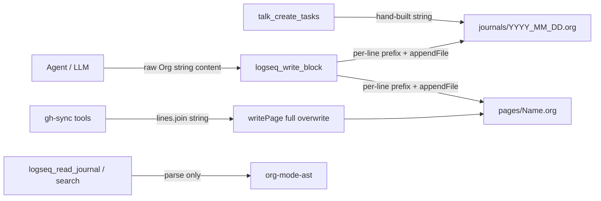
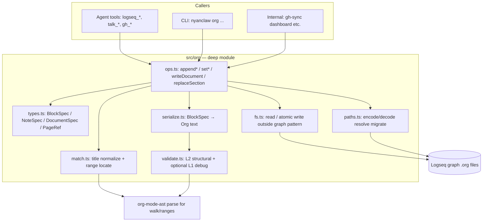
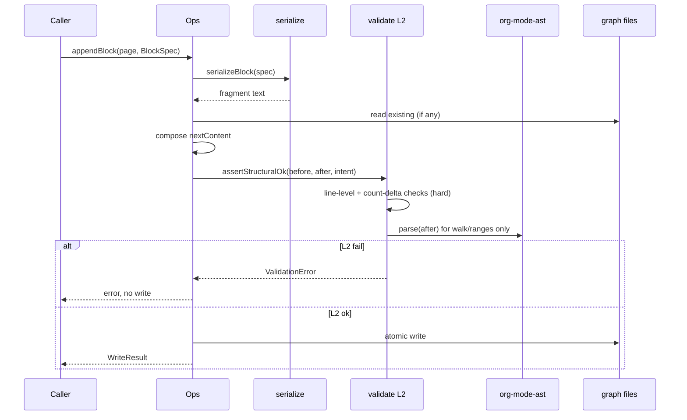
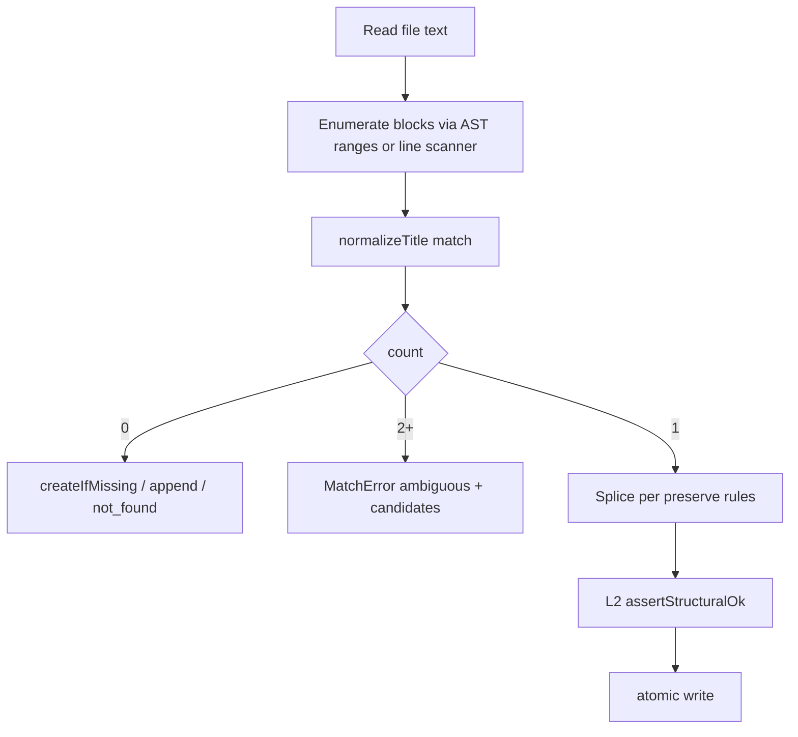
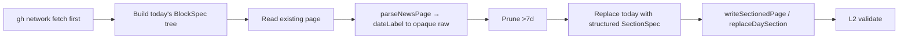
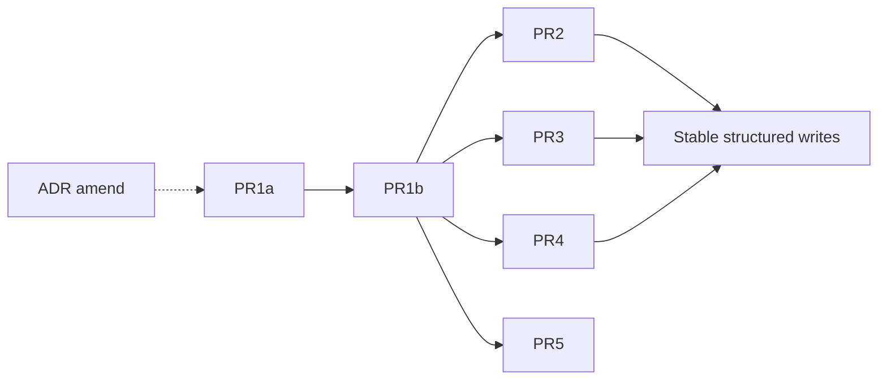

# 設計書: 安全・決定的な Org-mode 書き込み (nyanclaw)

| 項目 | 値 |
|------|-----|
| **Document** | Safe / deterministic Org-mode writing |
| **Author** | nyanclaw (design skill) |
| **Date** | 2026-07-15（rev. 3: 2026-07-16） |
| **Status** | Draft (rev. 3 — quote/record blocks) |
| **Related ADR** | [ADR-0001: Logseq as Source of Truth](../adr/0001-logseq-as-source-of-truth.md)（本設計で generate 方針を修正する follow-up ADR を出す — 下記 K9） |
| **Related context** | [`CONTEXT.md`](../../CONTEXT.md) (Org mode parsing / Logseq graph) |

---

## Overview

nyanclaw は Logseq のファイルベース Org グラフ（`journals/*.org`, `pages/*.org`）をタスクとジャーナルの Source of Truth としているが、現状の書き込みは **LLM が生成した生の Org 文字列** と **各ツール内の手組みテンプレート** に依存している。結果として、二重プレフィックス、ネスト破壊、`DEADLINE:` の兄弟化、ページ名エンコードの不一致など、Logseq が解釈できない・壊れた Org が頻繁に生成される。

本設計では、**LLM / ツールは構造化 intent のみを渡し、決定的なシリアライザが常に合法な Org バイト列を出力する** アーキテクチャへ移行する。安全性の主因は **`parse()` の成功ではなく、自由形式 Org を受理しないこと + nyanclaw 所有の L2 構造チェック** である。`org-mode-ast` は **レンジ取得・木 walk・「投げずにテキストを木にできるか」の補助** に使い、生成（serialize）は **Logseq サブセット専用のスキーマ駆動シリアライザ** が担う。全 write 経路（`logseq_*` ツール、`talk_create_tasks`、`gh-sync`、ノート追記）はこの単一モジュール経由にする。

---

## Background & Motivation

### 現状アーキテクチャ



| 書き込み経路 | ファイル | 方式 | 問題 |
|-------------|----------|------|------|
| `logseq_write_block` (`src/tools/logseq.ts`) | journal / page | 生 `content` を行ごとに `* ` / `- ` を前置して `appendFile` | 二重プレフィックス、複数行が兄弟になる、検証なし |
| `talk_create_tasks` (`src/tools/talk.ts`) | 当日 journal | 手組み `* TODO` + `  - TODO` + `  DEADLINE:` を append | planning の位置・インデントが壊れている、見出し vs リスト混在 |
| `gh-sync.ts` の `writePage` / `buildTodayNews` / `updateDashboard` | `pages/` | 文字列配列で見出しツリーを組み立てて全上書き | 専用ロジックが分散、page encode はここだけ、**dashboard の recent 検出が encode 済みファイル名と不一致**（後述）、検証なし |
| ADR-0001 / CONTEXT.md | — | 「`org-mode-ast` で parse/generate」と明記 | **generate は未実装**。parse は read/search のみ |

### 既知の失敗モード（コード根拠付き）

1. **二重プレフィックス**  
   `logseq_write_block` は `content` が既に `* ` / `- ` を含んでいても無条件で prefix する:

```223:225:src/tools/logseq.ts
    const lines = rawContent.split("\n");
    const prefix = asHeadline ? "* " : "- ";
    const block = "\n" + lines.map((l) => `${prefix}${l}`).join("\n") + "\n";
```

   例: content = `"TODO foo\nDEADLINE: <2026-07-20>"` + `asHeadline: true` →  
   `* TODO foo` と `* DEADLINE: <2026-07-20>` の **2 つの兄弟 headline** になる。

2. **複数行ボディの兄弟化**  
   上と同じ map が「1 ブロック = 1 見出し + ボディ」ではなく「行 = ブロック」として扱う。ネストや planning 行がすべて同レベルになる。

3. **talk の planning 破壊**  

```528:534:src/tools/talk.ts
    let journalEntry = `\n* TODO Prepare: ${title}\n`;
    for (const t of tasks) {
      if (t.deadline) {
        journalEntry += `  - TODO ${t.task}\n  DEADLINE: <${t.deadline}>\n`;
      } else {
        journalEntry += `  - TODO ${t.task}\n`;
      }
```

   - 親は headline、子は list item という混在。
   - `DEADLINE:` は子タスク見出し/リストの直下ではなく、親見出し配下で list と同インデントになりやすい。
   - `#Task` タグなし（CONTEXT のタスク表現と不一致）。

4. **ページ名エンコード不一致 + dashboard の自己矛盾**  
   - `gh-sync.ts`: write は `:` → `%3A`, `/` → `%2F`（`logseqEncode`）。  
   - `logseq.ts`: 生の `page` をファイル名に使う。  
   - `updateDashboard` は `readdir` 結果を `/^GH:(.+)\/news\.(org|md)$/` でマッチする — **encode 済み** `GH%3Aowner%2Frepo%2Fnews.org` には **決してマッチしない**。write 経路が作った news を dashboard が「recent」として拾えない既バグ。path 統一時に **decode + discovery 修正を同梱**する（PR4）。

5. **全上書き vs 無検証 append**  
   gh-sync は news を section map で merge するが、serialize は行配列の再結合のみ。構造検証なし。

6. **システムプロンプトの無力さ**  
   `src/agent/system-prompt.ts` L30: `When writing to Logseq files, use proper Org-mode format.`  
   モデルが正しい構文を出してもツールが壊す経路が残る。また read 側 `logseq_read_journal` は TODO/DONE のみバケットし、`WAITING` は “Other” に落ちる（CONTEXT のタスク表現とのギャップ）。

7. **長文の「引用・記録」が構造を保てない**（本番グラフ実例）  
   イベントページ `pages/イベント/Kaigi on Rails 2026.org` は、エージェントがフリーハンドで書いたあと手作業で一部直した状態。典型パターン:
   - ほぼ全行に `- ` が前置され、`- * Kaigi…` / `- :PROPERTIES:` / `- *** TODO` のように **list と headline / drawer が混線**
   - 概要全文を残そうとした末尾は手修正で次の形に寄せているが、途中段階では `* #+BEGIN_QUOTE` のように **keyword 行が headline 化**しうる:

```org
* 概要（全文）
#+BEGIN_QUOTE
筆者が開発する「Rigor」は、…
（複数段落。段落間は空行）
#+END_QUOTE
```

   「○○を引用して」「○○を記録して」は日常操作なのに、現状 API は **生 Org か plain note 行しかなく、quote ブロックを安全に出す経路がない**。`body[]` に `#+BEGIN_QUOTE` を書かせるとサニタイズ（`/^#\+/` reject）と衝突するため、**専用の構造化 op が必要**。

### なぜ今直すか

- Logseq が SoT（ADR-0001）。壊れたファイルはユーザーの日常グラフを汚染する。
- CONTEXT.md が ad-hoc 文字列操作を禁止し、AST/適切なパーサを要求している（スキーマ駆動生成は ad-hoc ではない）。
- 書き込み経路が既に 3 箇所に分岐しており、このまま機能を足すと失敗モードが複製される。

---

## Goals & Non-Goals

### Goals

1. **構造化 intent → 合法 Org** の単一 write パイプラインを導入する。
2. 既存の壊れた write 経路をすべてそのパイプラインに寄せる（ツール・内部モジュール・任意 CLI）。
3. **write-after-validate（L2 hard gate）**: compose 後の全文に対し nyanclaw 所有の **構造チェック** を走らせ、失敗時はディスクに書かない。`org-mode-ast` の `parse()` 非 throw は **十分条件ではない**（下記 Validation）。
4. タスク表現を CONTEXT に揃える: `TODO`/`DONE`/`WAITING` + 任意 `#Task` + `SCHEDULED:`/`DEADLINE:`。
5. ページパス解決（journal / page、`%3A` encode/decode、dashboard discovery）を一元化する。
6. ゴールデンテストでシリアライザの回帰と **既知失敗モードの reject** を防ぐ。
7. エージェント向けツール API から「生 Org `content: string`」を段階的に廃止する。
8. **非タスクのジャーナルノート**用に、依然としてスキーマ駆動の一次 API（`appendNote`）を提供する（自由形式 Org ではない）。
9. **引用・記録**（「○○を引用して」「この文面を記録して」）用に、`#+BEGIN_QUOTE` / `#+END_QUOTE` をシリアライザが決定的に出力する一次 API（`appendQuote`）を提供する。LLM はプレーン本文行だけ渡し、**BEGIN/END マーカーは生成器が所有**する。

### Non-Goals

1. **完全な Org-mode 実装**（export、footnote、column view、clock table 等）は対象外。Logseq で使うサブセットに限定。
2. **分散ロック / リアルタイム協調編集**。個人ツールとして mtime/hash ベースの楽観的チェック + last-writer-wins を明示するに留める。
3. **既存の壊れたユーザーファイルの自動修復を必須化**しない（任意の repair/audit は提供可）。
4. GitHub ↔ Logseq の双方向同期や、DB 版 Logseq API への移行は対象外（ADR-0001 の SoT 部分は維持）。
5. 読み取り UX の大規模刷新。ただし PR2 で **WAITING / `#Task` の表示**は最低限揃える（または明示 follow-up issue）。
6. `org-mode-ast` 本体への upstream パッチ依存（利用はするが増機能待ちにしない）。
7. LLM に任意 Org 構文を書かせる escape hatch は提供しない（`rawFragment` は **内部・テスト専用** でも公開ツールには出さない）。

---

## Proposed Design

### 設計原則

1. **Deep module**: 公開面は小さい。`structured ops in → valid Org bytes out`。
2. **LLM は構文を書かない**: タイトル・日付・TODO 状態・プレーンノート行などドメイン値だけ渡す。
3. **生成は決定的**: 同一入力 → 同一バイト列（末尾改行・planning 順・property キー順まで固定）。
4. **パースはライブラリ、生成は自前**: `org-mode-ast` は **export されている** が、`AstBuilder` はトークナイザ/パーサ状態に結合した設計で、**サポートされた「構造化データ → テキスト」生成 API ではない**。Logseq `#Task` や Planning の木形状にも癖がある。生成は自前スキーマ、検証の主軸は L2 構造チェック、parse は walk/range 補助。
5. **1 箇所の path resolver**: journal / page / encode / decode / migrate を共通化。
6. **安全性の源泉**: free-form Org を受理しないこと。`parse()` 成功は安全の証明に使わない。

### 目標アーキテクチャ



### パッケージ配置

```
src/org/
  types.ts       # BlockSpec, NoteSpec, DocumentSpec, PageRef, TodoKeyword, Timestamp, WriteResult, MatchError
  serialize.ts   # serializeBlock, serializeDocument, serializeNoteLines（決定性コメントをファイル先頭に）
  validate.ts    # assertStructuralOk (L2 hard), maybeRoundTrip (L1 debug)
  match.ts       # normalizeTitle, findBlockRanges, multi-match policy
  paths.ts       # resolveJournalPath, resolvePagePath, encodePageName, decodePageName, migrateToEncodedFormat
  fs.ts          # readOrgFile, writeOrgFileAtomic (temp outside .org pattern)
  ops.ts         # 公開操作 API
  index.ts       # re-export 公開面のみ
src/cli/org.ts   # 任意: thin CLI
```

ツール層（`src/tools/logseq.ts`, `talk.ts`, `gh-sync.ts`）は **Org 文字列を組み立てない**。すべて `src/org` の ops を呼ぶ。

### Logseq Org サブセット（生成対象）

シリアライザが **保証して出力する** 構文だけをサポートする。入力スキーマ外の自由文 Org は拒否する。

| 要素 | サポート | 出力例 |
|------|----------|--------|
| ファイルタイトル | Yes | `#+TITLE: page-name` |
| Headline ブロック | Yes | `* TODO Title #Task` |
| List ブロック | Yes | `- TODO Title #Task` |
| TODO keyword | `TODO` \| `DONE` \| `WAITING` \| なし | |
| Logseq タグ | `#Tag` をタイトル末尾。**呼び出し順を保持**、重複除去、先頭 `#` は strip | `#Task` |
| Planning | ブロック直下。**常に DEADLINE 行 → SCHEDULED 行** | `DEADLINE: <YYYY-MM-DD>` |
| ボディ行 | plain text のみ（下記サニタイズで拒否/正規化） | インデント付き |
| 子ブロック | 再帰 `children[]`。**level は親から継承**（下記 invariant） | |
| Property drawer | key を **辞書順** で出力 | `:PROPERTIES:` … `:END:` |
| Wiki link | タイトル/ボディ内の `[[page]]` は呼び出し側が文字列として渡す（生成器は marker 拒否のみ） | |
| ノート（非タスク） | `NoteSpec.lines` → プレーン list/paragraph 行 | `- note line` |
| **Quote ブロック** | `QuoteSpec` → 任意見出し + `#+BEGIN_QUOTE` … `#+END_QUOTE` | 下記「引用・記録」 |
| テーブル / src block | **生成 API では非対応**。news 履歴は opaque 保持（PR4 hybrid） | |
| 履歴セクション opaque | `rawSection?: string`（byte preserve） | gh-sync 他日分 |

**デフォルトスタイル**: ジャーナルへのタスク追記は **headline (`*`) + `#Task`**。list は `style: "list"` で明示。

### Level / children invariant（決定的）

**不変条件（K10）**:

1. **呼び出し側が `level` を指定してよいのはルートブロックのみ**（`appendBlock` / `appendBlocks` の各トップ要素、`DocumentSpec.blocks[]` の各トップ要素）。省略時 `level = 1`。
2. **`children[]` 内の `level` は省略必須**。シリアライザが常に `parentLevel + 1` を適用する。子に `level` が付いていたら **入力エラー**（無視しない・黙って上書きしない）。
3. **v1 は親と子の `style` 混在を禁止**。子の `style` 省略時は親を継承。子が親と異なる `style` を明示したらエラー。
4. **最大 depth = 3**（ルート level 1 → 子 2 → 孫 3）。それを超える `children` はエラー。
5. **最大 children 数 / op**: 50（ルート合計）。本文合計サイズは Security 節の上限に従う。

```text
// 正しい（talk 例）
{
  style: "headline", // level 省略 → 1
  todo: "TODO",
  title: `Prepare: ${title}`,
  tags: ["Task"],
  children: tasks.map((t) => ({
    // level なし
    todo: "TODO",
    title: t.task,
    tags: ["Task"],
    deadline: t.deadline ? { date: t.deadline } : undefined,
  })),
}
```

### シリアライズ規則（決定性）

`serialize.ts` 先頭コメントに以下を固定値として記載する。

| 規則 | 固定値 |
|------|--------|
| ブロック間空行 | 0 |
| ファイル末尾 | ちょうど 1 つの `\n` |
| タグ順 | **呼び出し順を保持**（ソートしない）。重複は先勝ちで除去。入力の先頭 `#` は strip |
| property キー順 | **ASCII 昇順ソート** |
| planning 順 | 常に **DEADLINE 次いで SCHEDULED**（片方が null なら省略） |
| Unicode | **NFC 正規化しない**（入力バイト/UTF-16 コードポイントをそのまま） |
| list indent | `"  ".repeat(level - 1) + "- "` |
| headline marker | `"*".repeat(level) + " "` |
| headline planning インデント | column 0（マーカーなし） |
| list planning インデント | コンテンツインデント（list marker 列より深い 2 spaces 基準） |
| quote マーカー | 常に column 0 の `#+BEGIN_QUOTE` / `#+END_QUOTE`（大文字固定）。インデントしない |
| quote 本文 | マーカー直下。**行頭に list/headline を付けない**。空行は段落区切りとしてそのまま残す |
| quote と見出し | `heading` あり → 先に headline 1 行、続けて quote。本文は heading の「子」ではなく **同一ブロック直下の greater element** として出力 |

```text
serializeBlock(block, level /* always explicit from parent walk */):
  reject if block.level != null && !isRootCall   // 子に level が来たらエラーは ops 側
  style = block.style ?? inheritedStyle
  marker = style === "headline" ? "*".repeat(level) + " "
         : "  ".repeat(level - 1) + "- "
  title = assertSafeTitle(block.title)   // 拒否ベース、黙って strip しない（下記）
  tags = normalizeTags(block.tags)       // strip #, dedupe preserving order
  // title 内の既存 #Tag と tags[] の重複も normalize で除去
  line = marker + (todo ? todo + " " : "") + title
       + (tags.length ? " " + tags.map(t => "#" + t).join(" ") : "")
  out = [line]
  if deadline: out.push(planningIndent + "DEADLINE: <" + formatTs(deadline) + ">")
  if scheduled: out.push(planningIndent + "SCHEDULED: <" + formatTs(scheduled) + ">")
  if properties: emit drawer (keys sorted)
  for bodyLine: out.push(bodyIndent + assertSafeBodyLine(bodyLine))
  for child in children:
    out.push(serializeBlock(child, level + 1, style))  // style 継承、level は常に +1
  return out.join("\n")
```

**入力検証（サニタイズ = 主に reject）**:

| 対象 | 規則 |
|------|------|
| `title` | 改行禁止。`/^\*+\s/` または `/^-\s/` で始まる → **reject**（黙って strip しない。二重プレフィックスの主因を呼び出し側に返す）。空・空白のみ禁止。長さ ≤ 500。 |
| `title` 内 | 制御文字禁止。 |
| `body[]` / `NoteSpec.lines[]` | 各行: 改行を含まない。`/^\*+\s/`、`/^(DEADLINE|SCHEDULED)\s*:/i`、`/^:PROPERTIES:$/`、`/^:END:$/`、`/^#\+/` にマッチ → **reject**。行長合計 ≤ 32KiB / op。 |
| **`QuoteSpec.lines[]`** | 各要素は 1 論理行（中に `\n` 禁止。空文字 `""` は quote 内の空行）。`/^\*+\s/`、`/^-\s/`、`/^#\+/i`、`/^(DEADLINE|SCHEDULED)\s*:/i`、`/^:PROPERTIES:$/`、`/^:END:$/` → **reject**（マーカーはシリアライザ専有。`#+BEGIN_QUOTE` を本文に書かせない）。合計 ≤ 32KiB / op。最低 1 行（空文字のみの 1 要素は可だが無意味なので `lines.length >= 1` かつ「すべて trim 後空」は reject）。 |
| `tags[]` | 各要素から先頭 `#` を strip。`/^\S+$/`。大文字小文字区別で dedupe（先勝ち）。 |
| タイムスタンプ | `date` は `/^\d{4}-\d{2}-\d{2}$/`。`time` は任意 `/^\d{2}:\d{2}$/`。active `<...>` のみ生成。 |
| gh-sync タイトル | Issue/PR タイトルも **同じ `assertSafeTitle`** を通す（改行は空白化ではなく reject → 呼び出し側で空白に正規化してから渡すのが gh-sync の責任）。 |

### 引用・記録（Quote）— 第一級 serialize 対象

ユーザー発話の典型: 「この概要を引用して」「CfP 文面をイベントページに記録して」。

**設計方針**:

1. LLM は **プレーンテキスト行配列**だけ渡す。`#+BEGIN_QUOTE` / `#+END_QUOTE` を引数に含めさせない。
2. シリアライザだけが marker を emit する → `* #+BEGIN_QUOTE` や `- #+BEGIN_QUOTE` の兄弟化が起きない。
3. 任意の **見出し**（例: `概要（全文）`）を付けて「見出し + quote」を 1 op で append できる。
4. `appendNote`（短いメモ行）と用途を分ける: 複数段落・原文保持は **quote**、一行メモは **note**。

```text
serializeQuote(spec: QuoteSpec):
  out = []
  if spec.heading:
    level = spec.level ?? 1
    // BlockSpec と同じ title/tag 規則
    out.push("*".repeat(level) + " " + assertSafeTitle(heading) + tagsSuffix)
  out.push("#+BEGIN_QUOTE")
  for line in spec.lines:
    out.push(assertSafeQuoteLine(line))  // "" → 空行
  out.push("#+END_QUOTE")
  return out.join("\n") +  // 呼び出し側が末尾 \n を文書規則に合わせる
```

**正規出力例**（`heading: "概要（全文）"`, lines = 段落…）:

```org
* 概要（全文）
#+BEGIN_QUOTE
筆者が開発する「Rigor」は、人力での運用と型の知識をほとんど必要としない、Rubyのための新しい静的解析ツールです。

Rubyにおける型エコシステムが発展を続ける一方、…
#+END_QUOTE
```

**壊れた出力（禁止・L2 で reject 対象）**:

```org
* #+BEGIN_QUOTE
- 筆者が開発する…
* #+END_QUOTE
```

```org
- #+BEGIN_QUOTE
- 段落1
- #+END_QUOTE
```

v1 スコープ:

| できる | やらない |
|--------|----------|
| ページ/journal 末尾に heading+quote を append | 既存見出しの途中への splice 挿入（Open Question #7。v1 は末尾 append のみ） |
| quote 内の空行（段落区切り） | ネスト quote、`#+BEGIN_VERSE` 等の他 greater element |
| 複数回 append で複数 quote セクション | quote 本文の後から部分編集 API |

**ドキュメント**:

```text
serializeDocument({ title?, blocks[] }):
  lines = []
  if title: lines.push("#+TITLE: " + title)
  for b in blocks: lines.push(serializeBlock(b, b.level ?? 1))
  // ブロック間 0 空行、末尾 1 \n
```

### 検証（compose 後・write 前）— L2 が hard gate



#### L1 Soft（sanity / debug only — hard gate にしない）

- `parse(text)` が throw しないこと、および可能なら `root.rawValue === text`。
- **`org-mode-ast@0.13.5` では** 空文字・平文・壊れた `* DEADLINE:` 兄弟・不正 timestamp 風テキストなども **ほとんど throw せず rawValue 冪等**であることが確認されている。
- よって L1 は **NYANCLAW_ORG_DEBUG 時のログ**と「パーサが完全にクラッシュしない」程度の情報。**write の成否は L1 に依存しない**。

#### L2 Structural（**すべての op の hard gate**）

Planning **AST ノード型に依存しない**。主に **行スキャナ + headline/list 行カウント**。

共通（compose 後の full text）:

1. **Forbidden sibling planning-as-headline**: トップレベル（および検出した headline 行）で、タイトル部分が `/^(DEADLINE|SCHEDULED)\s*:/` にマッチする `^\*+\s` 行が **新規に増えていない**（after 全体に存在しないことが理想。既存ユーザー汚染がある場合は **今回の fragment 範囲内**に無いこと）。
2. **Fragment self-check**: 書き込む fragment 単体を行スキャンし、(a) 先頭が期待 marker、(b) planning 行が `^\*+\s` でない、(c) `serializeBlock` の再実行結果と fragment が一致（決定性）。
3. **Net count delta**（append 系）:  
   - 追加したルートブロック数だけ `headline` または `list-item` 行が増える。  
   - children を含む期待 marker 行数 = `countBlocks(spec)`。  
   - `DEADLINE:` / `SCHEDULED:` 行の増分 = spec 上の planning 数。
4. **No double markers**: 行が `/^\*+\s+\*+\s/` または `/^(\s*)-\s+-\s/` でない。
5. **Path containment**: 解決済みパスが graph root 配下。

op 固有:

| op | 追加 L2 |
|----|---------|
| `appendBlock(s)` / `appendNote` | 上記 delta。ノートは TODO/planning 行が増えないこと |
| `appendQuote` | fragment 内に `#+BEGIN_QUOTE` / `#+END_QUOTE` が **ちょうど 1 組**、この順、column 0。間に `^\*+\s` / `^-\s` 行が無い。heading ありなら fragment 先頭がちょうど 1 本の headline。`* #+BEGIN` / `- #+BEGIN` が after 全文に **今回の fragment 起因で**増えていないこと |
| `setTodoState` | マッチ headline 行の todo keyword のみが変わり、planning/body バイトが意図どおり保持 |
| `setPlanning` | 対象ブロックの planning 行セットが期待と一致。他ブロック不変 |
| `upsertTask` | マッチ 0 → append と同一 delta。マッチ 1 → タイトル正規化キー同一のままフィールド merge |
| `writeDocument` | 期待トップレベル見出し集合（または opaque splice 後の section 数） |
| `replaceDaySection` | 対象日見出しレンジ外のバイト列が before と同一 |

**失敗時**: ディスク未変更。`{ code, check, snippet, candidates? }`。

**ゴールデン（reject 系必須）**: 旧 `logseq_write_block` が生成する二重 prefix 断片、talk 旧形式、`* DEADLINE:` 兄弟、title 先頭 `*`、body 内 planning 行などを **L2 が write 前に落とす**ことを `validate.test.ts` で固定する。

> Planning ノード型の厳密一致には依存しない（連続 DEADLINE/SCHEDULED で 2 行目が `planningKeyword`+`text` になる既知癖あり）。

### 公開 Ops API

```typescript
// src/org/types.ts（概念）

export type TodoKeyword = "TODO" | "DONE" | "WAITING";

export type OrgTimestamp = {
  date: string; // YYYY-MM-DD
  time?: string; // HH:MM
};

export type BlockStyle = "headline" | "list";

/** ルートのみ level 可。children では level 禁止。 */
export type BlockSpec = {
  style?: BlockStyle; // default: "headline" at root; children inherit
  level?: number; // root only; default 1; children must omit
  todo?: TodoKeyword | null;
  title: string;
  tags?: string[]; // without '#'; e.g. ["Task"]
  deadline?: OrgTimestamp | null;
  scheduled?: OrgTimestamp | null;
  properties?: Record<string, string>;
  body?: string[];
  children?: BlockSpec[]; // no level; same style as parent in v1
};

/** 非タスクノート。自由形式 Org ではない。 */
export type NoteSpec = {
  style?: "list" | "paragraph"; // default "list" → each line becomes "- …"
  lines: string[]; // plain text lines only (L2/assertSafeBodyLine)
  page?: PageRef; // default today journal — actually passed to op, not inside if cleaner
};

/**
 * 引用・記録。BEGIN/END_QUOTE は serialize が所有。
 * 「○○を引用して」「○○を記録して」→ エージェントはこの shape だけ埋める。
 */
export type QuoteSpec = {
  /** 付けると先に headline。省略時は quote ブロックのみ（ページ末尾）。 */
  heading?: string;
  level?: number; // heading があるときのみ。default 1。children 概念なし
  tags?: string[]; // heading があるときのみ意味あり
  /**
   * 引用本文。各要素 = 1 行。"" = 段落区切りの空行。
   * 改行文字を含めてはならない（複数段落は配列要素を分ける）。
   */
  lines: string[];
};

export type PageRef =
  | { kind: "journal"; date?: string } // ISO YYYY-MM-DD; default today → file YYYY_MM_DD.org
  | { kind: "page"; name: string }; // logical name, e.g. "GH:owner/repo/news"

export type DocumentSpec = {
  title?: string;
  blocks: BlockSpec[];
};

/** gh-sync 用: 履歴日は opaque、当日だけ BlockSpec */
export type SectionSpec =
  | { dateLabel: string; kind: "structured"; blocks: BlockSpec[] }
  | { dateLabel: string; kind: "opaque"; raw: string }; // includes leading "* dateLabel\n" or not — fixed in impl: raw is full section body with first line headline

export type TaskMatch =
  | { byTitle: string; page: PageRef; scope?: "level1" | "level1-2" } // default level1-2
  | { byTitleUnder: { parentTitle: string; title: string }; page: PageRef }
  | { byId: string; page: PageRef }; // :id: property when present

export type WriteResult = {
  path: string;
  op: "create" | "append" | "replace" | "upsert" | "splice";
  bytes: number;
  validated: true;
  mtimeBeforeMs?: number;
  contentHashBefore?: string; // e.g. sha256 hex of prior file (debug / concurrency)
};
```

```typescript
// src/org/ops.ts — 公開関数

/** ページ末尾にブロック木を append。無ければ #+TITLE 付き create。 */
export function appendBlock(page: PageRef, block: BlockSpec): Promise<WriteResult>;

export function appendBlocks(page: PageRef, blocks: BlockSpec[]): Promise<WriteResult>;

/** 非タスク: プレーン行を list/paragraph として append。 */
export function appendNote(page: PageRef, note: NoteSpec): Promise<WriteResult>;

/**
 * 引用・記録: 任意 heading + #+BEGIN_QUOTE … #+END_QUOTE を append。
 * LLM は lines にプレーン文だけ。marker はここでのみ生成。
 */
export function appendQuote(page: PageRef, quote: QuoteSpec): Promise<WriteResult>;

/** 全文を structured document で置換（dashboard 等、履歴 preserve 不要なページ）。 */
export function writeDocument(page: PageRef, doc: DocumentSpec): Promise<WriteResult>;

/**
 * 日次 section を持つページ向け hybrid write。
 * structured の日だけ serialize。opaque の日は raw をそのまま連結。
 * 他日バイトを BlockSpec に通さない。
 */
export function writeSectionedPage(
  page: PageRef,
  sections: SectionSpec[],
  opts?: { title?: string; sortDateDesc?: boolean },
): Promise<WriteResult>;

/** 1 日分だけ差し替え: 対象 dateLabel の headline レンジを splice。他バイト不変。 */
export function replaceDaySection(
  page: PageRef,
  dateLabel: string,
  section: SectionSpec,
): Promise<WriteResult>;

export function setTodoState(
  match: TaskMatch,
  state: TodoKeyword | null,
  opts?: { createIfMissing?: boolean; template?: BlockSpec },
): Promise<WriteResult>;

export function setPlanning(
  match: TaskMatch,
  planning: { deadline?: OrgTimestamp | null; scheduled?: OrgTimestamp | null },
): Promise<WriteResult>;

/**
 * 冪等タスク: マッチキー = normalizeTitle(title) + page（+ optional parent）。
 * merge: todo/deadline/scheduled/tags は引数で渡されたフィールドのみ置換（tags は replace 全体、union しない）。
 * body/children が引数に無ければ既存 body/children バイトを保持。
 */
export function upsertTask(page: PageRef, block: BlockSpec): Promise<WriteResult>;

export function renderBlock(block: BlockSpec): string;
export function renderDocument(doc: DocumentSpec): string;
export function renderNote(note: NoteSpec): string;
export function renderQuote(quote: QuoteSpec): string;
```

### Mutate 戦略（詳細仕様）

#### タイトル正規化 `normalizeTitle(raw: string): string`

1. 行頭の headline/list marker を除去（`/^\*+\s+/`, `/^\s*-\s+/`）。
2. 先頭の TODO keyword（`TODO|DONE|WAITING`）を除去。
3. 末尾の Logseq タグ列 `/(\s+#\S+)+$/` を除去。
4. 前後 whitespace collapse（内部は単一スペースへ正規化は **しない** — trim のみ。内部空白は保持）。
5. 比較は **exact string match**（Unicode は NFC しない）。

`TaskMatch.byTitle` の `byTitle` も同じ normalize をかけてから比較する。

#### ブロック列挙とバイトレンジ

1. ファイル全文を読む。
2. **第一選択**: `org-mode-ast` `parse` 後、`Headline` ノードの `start`/`end`（および list の場合は listItem の range）を使う。  
3. **フォールバック**: 行スキャナで `/^(\*+)\s+(?:(TODO|DONE|WAITING)\s+)?(.*)$/` および list 相当を検出し、次の同レベル以上の marker 行の直前までをレンジとする。planning / drawer / body はレンジに含む。
4. v1 マッチ対象: `scope: "level1-2"`（既定）= level 1–2 の headline **および** 同一レベルの list item タスク行。`level1` に制限可。
5. list スタイル `- TODO title #Task` も normalize 後に同じキーでマッチ。

#### マルチマッチ

- **0 件**: `set*` は `createIfMissing` でなければ `MatchError { code: "not_found" }`。`upsertTask` は append。
- **2 件以上**: **黙って first を選ばない**。`MatchError { code: "ambiguous", candidates: [{ title, level, start, end }] }` を返しエージェントにタイトルを絞らせる。
- `byTitleUnder`: parent normalize 一致の子のみを候補に。

#### 部分更新の preserve 意味論

| op | 書き換える範囲 | 保持 |
|----|----------------|------|
| `setTodoState` | **headline/list 行のみ**（todo keyword の挿入・置換・削除）。可能なら行内 splice | planning 行、drawer、body、children のバイト列は **一切変更しない** |
| `setPlanning` | 対象ブロックの **planning 行セットのみ**（DEADLINE/SCHEDULED 行を削除してから正規順で再挿入。drawer の直前）。headline 行は不変 | body / children / drawer 不変 |
| `upsertTask` で fields 部分指定 | 渡されたフィールドに対応する行だけ更新。`body`/`children` 未指定ならヘッダ+planning(+drawer if props) のみ再 serialize して **旧 body/children バイトを後段に連結** | 未指定フィールド |
| `upsertTask` で full replace | `body` または `children` が渡されたときのみブロック全体を `serializeBlock` で置換 | レンジ外 |

v1 では **深い children の部分編集はしない**。フル `BlockSpec` 置換は `body`/`children` 明示時のみ。

`:id:` による `byId` は Open Question #3 どおり **任意**。安定キーが必要な talk 再実行は、まず normalizeTitle（例: `Prepare: ${title}`）の一意性に依存し、衝突時は ambiguous エラー。



### パス解決の統一

```typescript
export function encodePageName(name: string): string {
  return name.replace(/:/g, "%3A").replace(/\//g, "%2F");
}

export function decodePageName(fileBase: string): string {
  // strip .org/.md; decode %3A %2F (and common variants)
  return fileBase.replace(/\.org$|\.md$/i, "")
    .replace(/%3A/gi, ":")
    .replace(/%2F/gi, "/");
}

export function resolvePath(ref: PageRef, graphRoot: string): string { /* ... */ }
```

- **Write**: 常に encode 済みファイル名。`migrateToEncodedFormat` を paths に移設。
- **Read**: bare / encoded の両方を候補。
- **Dashboard / readdir discovery**（PR4 必須）:  
  - ファイル名を `decodePageName` してから論理名 `GH:owner/repo/news` と照合。  
  - 正規表現を bare 前提にしない。  
  - **ユニットテスト**: `GH:o/r/news` → encode → file → decode → 元論理名。

### エージェントツールの変更

#### 構造化ツール群

| 新ツール名 | パラメータ（要旨） | 内部 |
|------------|-------------------|------|
| `logseq_append_block` | 下記スキーマ | `appendBlock` |
| `logseq_append_note` | `lines: string[]`, `style?`, `journalDate?` XOR `page?` | `appendNote` |
| **`logseq_append_quote`** | `lines: string[]`, `heading?`, `tags?`, ページ指定 | `appendQuote` |
| `logseq_set_todo` | `title`, `state`, ページ指定 | `setTodoState` |
| `logseq_set_planning` | `title`, `deadline?`, `scheduled?`（ISO 日付文字列 → `OrgTimestamp`） | `setPlanning` |
| `logseq_upsert_task` | append と同形 + 上記 merge ポリシー | `upsertTask` |

- **廃止**: `content: string` の `logseq_write_block`。1 リリース `NYANCLAW_ORG_LEGACY_WRITE=1` でのみ旧実装。通常パスに「title だけ strip する薄い互換」は **置かない**（偽の notes API になるため）。ノートは `logseq_append_note`。長文・原文の保存は **`logseq_append_quote`**。
- `logseq_read_journal` / `logseq_search` は維持。PR2 で read の TODO バケットに **WAITING** を追加し、可能ならタグを表示。
- エージェントに **ページ全文 overwrite ツールは出さない**（`writeDocument` は内部/gh-sync 用）。

#### 引用・記録のツールとプロンプト規約

```typescript
// logseq_append_quote
parameters: Type.Object({
  lines: Type.Array(Type.String({ description: "One plain text line; empty string = blank line inside quote. No #+BEGIN/END, no leading * or -." }), {
    minItems: 1,
    maxItems: 500,
  }),
  heading: Type.Optional(Type.String({ description: "Optional headline above the quote, e.g. 概要（全文）. Title only." })),
  tags: Type.Optional(Type.Array(Type.String(), { maxItems: 10 })),
  journalDate: Type.Optional(Type.String()),
  page: Type.Optional(Type.String({ description: "Logical page, e.g. イベント/Kaigi on Rails 2026" })),
})
```

**システムプロンプト（PR2）に明記するルーティング**:

| ユーザー意図（例） | 使うツール | 渡すもの |
|--------------------|------------|----------|
| 「この文を引用して」「原文を残して」「quote して」 | `logseq_append_quote` | 段落を `lines` に分割（空行は `""`）。必要なら `heading` |
| 「メモして」「一行書いて」 | `logseq_append_note` | 短い plain lines |
| 「タスク追加」「TODO」 | `logseq_append_block` / upsert | title / todo / deadline |
| Org 構文を自分で組み立てて書く | **禁止** | — |

エージェントは **outline や他ページから読んだ本文を `lines` にコピー**してよく、自分で `#+BEGIN_QUOTE` を書いてはならない。

#### ツール境界のページ指定

```typescript
// 共通: journal と page は排他
journalDate: Type.Optional(Type.String({ description: "YYYY-MM-DD; default today → journals/YYYY_MM_DD.org" })),
page: Type.Optional(Type.String({ description: "Logical page name (not file path). Encoded on write." })),
// 両方指定 → エラー。どちらも無し → 今日の journal。
```

ISO `YYYY-MM-DD` のみ受け、ファイル名の underscore 形式への変換は `paths` が行う（エージェントに `YYYY_MM_DD` を要求しない）。

#### 日付・ネスト境界

- `deadline` / `scheduled`: ツールは **文字列** `YYYY-MM-DD` または `YYYY-MM-DD HH:MM`。ops へ入れる前にパースし不正ならツールエラー。
- `children`: Typebox で **最大 depth 2 の入れ子**（ルート+子+孫）を明示的に 2 段まで展開するか、実行時に depth カウント。max 50 children / 32KiB。
- `logseq_upsert_task` の冪等キー: `normalizeTitle(title) + page`（+ optional parentTitle）。merge は「渡したフィールドのみ置換、tags は全体 replace」。

#### `talk_create_tasks`

```typescript
await appendBlocks({ kind: "journal" }, [
  {
    style: "headline",
    todo: "TODO",
    title: `Prepare: ${title}`,
    tags: ["Task"],
    children: tasks.map((t) => ({
      todo: "TODO",
      title: t.task,
      tags: ["Task"],
      deadline: t.deadline ? { date: t.deadline } : undefined,
    })),
  },
]);
```

出力イメージ:

```org
* TODO Prepare: My Talk #Task
** TODO Submit CfP for "My Talk" @ Conf #Task
DEADLINE: <2026-08-01>
** TODO Complete slides for "My Talk" #Task
DEADLINE: <2026-09-01>
```

#### `gh-sync.ts`（hybrid section モデル）



- **ネットワーク I/O を先に完了**し、その後に read→merge→validate→write を短時間で行う（compose 中に Logseq が書きやすい窓を最小化）。
- **履歴日**: `kind: "opaque", raw: sectionText` のまま保持。BlockSpec に通さない → テーブル/ユーザー編集を落とさない。
- **当日**: `kind: "structured", blocks: [...]` のみ serialize。Issue タイトルは事前に改行→空白正規化してから `assertSafeTitle`。
- **dashboard**: `decodePageName` で recent news を検出。PR4 の必須項目（挙動「維持」ではなく **encode バグ修正込み**）。

### CLI（推奨・薄い）

```bash
bun run src/cli/org.ts append --journal today --todo TODO --tag Task --title "Buy milk" --deadline 2026-07-20
bun run src/cli/org.ts note --journal today --line "reflection..."
bun run src/cli/org.ts quote --page "イベント/Kaigi on Rails 2026" --heading "概要（全文）" --file abstract.txt
bun run src/cli/org.ts render --title "Buy milk" --todo TODO
bun run src/cli/org.ts validate --file path/to/x.org   # L2 checks on file
bun run src/cli/org.ts audit --graph "$GRAPH"
```

### 並行書き込みと atomic write の場所

- **strict locking はしない**。Logseq UI との関係は **last-writer-wins** を明示。
- **mtime 粒度**: 同一秒内の衝突は見えないことがある → `WriteResult.contentHashBefore`（任意）でデバッグ。リトライは 1 回、その後エラー（エージェントは再読込して再適用）。
- **atomic write の temp 配置**（K11）:
  1. **推奨**: 同一 volume 上の `os.tmpdir()` に `.nyanclaw-write-<pid>-<rand>` を書き、`rename` で最終 `.org` へ。  
  2. tmpdir が別 volume で `rename` できない場合: ターゲットと **同じディレクトリ** に **ドットプレフィックスかつ非 `.org` 接尾辞**（例: `.nyanclaw-write-<pid>`）を使い、Logseq の page パターンに載せない。  
  3. **禁止**: `foo.org.tmp.<pid>` のような **`.org` を含む**一時名を graph 配下に置かない。
  4. 同一 FS rename の前提を `fs.ts` コメントに記載。必要なら rename 前に `fsync`（個人ツールでは optional）。
- append も read → concat → L2 → atomic write（生 `appendFile` 廃止）。

### 既存ファイルの migration / repair

| 方針 | 内容 |
|------|------|
| **デフォルト** | 既存ファイルは触らない |
| **audit** | L2 的壊疑（planning-as-headline 等）を列挙。`parse` throw は稀なので主に行スキャナ |
| **repair** | 明示実行のみ。安全な正規化に限定 |

### Residual risk / residual breakage

| 残存リスク | 深刻度 | 扱い |
|------------|--------|------|
| Legacy flag で旧 `logseq_write_block` を再有効化 | 中 | デフォルト off、短期削除 |
| 引用意図なのに `append_note` / 旧 raw write を使う | 中 | system prompt ルーティング表 + ツール description に「引用は append_quote」 |
| quote 内にユーザーが `*` 始まりの行を入れたい | 低 | reject。必要なら将来 escape 規則（v1 非対応） |
| `body`/`title` にユーザーが意図的に特殊文字を入れたい | 低 | reject して説明。自由 Org は非目標 |
| タイトルに既に `#Task` があり tags にも `Task` | 低 | normalizeTags / title タグ strip で重複除去 |
| GH タイトルの `*` / `[[` | 低 | sanitize + gh 側 pre-normalize |
| L2 が Logseq list の planning 意味論を完全にはモデル化しない | 中 | 生成側は正規形のみ。ユーザー手編集 list planning は mutate で触らない範囲を狭く |
| Logseq UI 同時編集 | 中 | last-writer-wins。gh-sync は fetch 後に短い write 窓 |
| opaque section の手編集構文 | 低 | 保持する（再 serialize しない） |
| `org-mode-ast` range のずれ | 低 | line scanner fallback + L2 |

**結論**: 主経路の破損（二重 prefix、talk planning、encode 分裂）は構造化 API で閉じる。安全性は **free-form 非受理 + L2** に依存し、**`parse()` 成功には依存しない**。

### テスト戦略

```
src/org/__tests__/
  serialize.golden.test.ts
  serialize.quote.golden.test.ts  # heading+quote 正規形
  validate.reject.test.ts    # 既知失敗モードが L2 で落ちる
  match.test.ts              # normalizeTitle, ambiguous
  ops.append.test.ts         # temp graph
  ops.note.test.ts
  ops.quote.test.ts
  ops.mutate.test.ts         # setTodo / setPlanning preserve
  paths.test.ts              # encode/decode roundtrip GH:o/r/news
  fs.atomic.test.ts          # temp not matching *.org page pattern
```

| ID | 内容 |
|----|------|
| G1–G5 | 従来ゴールデン（単一 marker、planning 非兄弟、nest level、tags） |
| GQ1 | heading + multi-paragraph quote（空行含む）が Kaigi 手修正形と一致 |
| GQ2 | heading なし quote のみ |
| R1 | 旧 double-prefix fragment が L2 reject |
| R2 | title `"* TODO x"` が serialize 入力で reject |
| R3 | body 行 `DEADLINE: <…>` が reject |
| R4 | quote.lines に `#+BEGIN_QUOTE` / `* foo` / `- bar` が serialize 入力で reject |
| R5 | 壊れた `* #+BEGIN_QUOTE` fragment が L2 reject |
| M1 | setTodoState が body を保持 |
| M2 | 同名タスク 2 件で ambiguous |
| P1 | encode/decode/dashboard discovery |

各 consumer PR（logseq tools / talk / gh-sync）は **temp-graph 結合テストを最低 1 本**。

### システムプロンプト更新（PR2）

- 削除: `When writing to Logseq files, use proper Org-mode format.`
- 追加: タスクは `logseq_append_block` / `logseq_set_todo` / `logseq_set_planning` / `logseq_upsert_task`。メモ・振り返りは `logseq_append_note`（プレーン行）。**引用・原文の記録は `logseq_append_quote`**（`#+BEGIN_QUOTE` は自分で書かない）。**Org 構文をツール引数に書かない**。
- read 側 WAITING 表示修正を同 PR または即 follow-up で追跡。

### ADR follow-up（K9）

実装 PR と並行または直前に **ADR-0001 修正** または **ADR-0004** を追加:

> Task listing and state changes operate on Logseq files. **Parse / tree-walk via `org-mode-ast`. Generate via nyanclaw’s deterministic Logseq-subset serializer. Accept writes only after structural (L2) validation** (re-parse is auxiliary, not the sole gate).

CONTEXT.md の「ad-hoc 文字列禁止」は本設計の schema-driven serialize と整合。文言を ADR 側で明確化する。

---

## API / Interface Changes

### Before: `logseq_write_block`

```typescript
parameters: {
  content: string;      // Org-mode syntax（LLM 任せ）
  page?: string;
  asHeadline?: boolean;
}
```

### After: `logseq_append_block`

```typescript
parameters: Type.Object({
  title: Type.String({ description: "Title text only; no leading * or -; no newlines" }),
  todo: Type.Optional(Type.Union([
    Type.Literal("TODO"), Type.Literal("DONE"), Type.Literal("WAITING"),
  ])),
  tags: Type.Optional(Type.Array(Type.String(), { maxItems: 10 })),
  deadline: Type.Optional(Type.String({ description: "YYYY-MM-DD or YYYY-MM-DD HH:MM" })),
  scheduled: Type.Optional(Type.String({ description: "YYYY-MM-DD or YYYY-MM-DD HH:MM" })),
  body: Type.Optional(Type.Array(Type.String(), { maxItems: 100 })),
  journalDate: Type.Optional(Type.String({ description: "YYYY-MM-DD; default today" })),
  page: Type.Optional(Type.String({ description: "Logical page name; XOR with journalDate" })),
  style: Type.Optional(Type.Union([Type.Literal("headline"), Type.Literal("list")])),
  // children: max depth enforced at runtime (≤2 nested levels under root)
  children: Type.Optional(Type.Array(Type.Object({
    title: Type.String(),
    todo: Type.Optional(/* same */),
    tags: Type.Optional(Type.Array(Type.String())),
    deadline: Type.Optional(Type.String()),
    scheduled: Type.Optional(Type.String()),
    body: Type.Optional(Type.Array(Type.String())),
    children: Type.Optional(Type.Array(Type.Object({
      title: Type.String(),
      todo: Type.Optional(/* same */),
      tags: Type.Optional(Type.Array(Type.String())),
      deadline: Type.Optional(Type.String()),
      scheduled: Type.Optional(Type.String()),
      body: Type.Optional(Type.Array(Type.String())),
      // no further children in tool schema (depth cap)
    }))),
  }))),
})
```

### After: `logseq_append_note`

```typescript
parameters: Type.Object({
  lines: Type.Array(Type.String({ description: "Plain text line; no Org markers" }), { minItems: 1, maxItems: 100 }),
  style: Type.Optional(Type.Union([Type.Literal("list"), Type.Literal("paragraph")])),
  journalDate: Type.Optional(Type.String()),
  page: Type.Optional(Type.String()),
})
```

### After: `logseq_append_quote`

```typescript
parameters: Type.Object({
  lines: Type.Array(Type.String(), { minItems: 1, maxItems: 500 }),
  heading: Type.Optional(Type.String()),
  tags: Type.Optional(Type.Array(Type.String(), { maxItems: 10 })),
  journalDate: Type.Optional(Type.String()),
  page: Type.Optional(Type.String()),
})
// 内部: appendQuote → serializeQuote → L2 → atomic write
// 出力: [optional * heading] + #+BEGIN_QUOTE + lines + #+END_QUOTE
```

### 内部: gh-sync

```typescript
// Before
writePage(name: string, content: string): void

// After
writeSectionedPage({ kind: "page", name }, sections: SectionSpec[])
// or replaceDaySection for single-day update
// dashboard: decodePageName on readdir entries
```

---

## Data Model Changes

- Logseq グラフのオンディスクスキーマ変更なし。
- 内部 TypeScript モデル: `BlockSpec`, `NoteSpec`, `QuoteSpec`, `SectionSpec`, `DocumentSpec`。
- nyanclaw が書くタスク正規形:

```org
* TODO Example task #Task
DEADLINE: <2026-07-20>
SCHEDULED: <2026-07-15>
:PROPERTIES:
:id: optional-uuid
:END:
  optional body line
```

- nyanclaw が書く引用・記録の正規形:

```org
* 概要（全文）
#+BEGIN_QUOTE
paragraph one…

paragraph two…
#+END_QUOTE
```

---

## Alternatives Considered

### A. `org-mode-ast` のノード組み立てで生成する

- **内容**: export されている `AstBuilder` / `OrgNode` で tree を組み `rawValue` 出力。
- **利点**: ライブラリ冪等性を生成にも使える可能性。旧 ADR 文言に近い。
- **欠点**: `AstBuilder` は **公開 export だがパーサ設計に密結合**で、構造化 JSON→Org のサポート API ではない。Planning/`#Task` に癖。コスト対効果悪い。
- **判定**: **生成には不採用**。walk/range と補助には採用。

### B. 現状維持 + プロンプト / ヒューリスティック prefix

- **判定**: **不採用**（根本原因が残る）。

### C. 外部 `logseq` CLI に全面委譲

- **内容**: CONTEXT 言及の Node CLI（`list task`, `upsert block` 等）。
- **利点**: 公式操作に近い可能性。
- **欠点**: バイナリ/バージョン/グラフ形式（org vs md）差、オフライン、ゴールデン決定性が自前より難しい、shell エラー面が暗い。
- **判定**: **主経路不採用**。将来は **同一 ops インターフェースの裏に差し込む adapter** として spike 可能（ports & adapters）。spike 項目: graph path 引数、org グラフでの upsert が headline を壊さないか、CI で CLI をどう固定するか。

### D. 本設計: スキーマ駆動シリアライザ + L2 構造検証 + 単一 ops

- **判定**: **採用**。

### E. uniorg / 他の Org AST（generator 付き）

- **内容**: [uniorg](https://github.com/rasendubi/uniorg) 等、unified 系で stringify できるスタックへ移行。
- **利点**: 生成がライブラリ側にある可能性。
- **欠点**: 依存追加、Logseq 方言（`#Task`、ファイル名 encode、list TODO）は結局自前ルールが必要、既存 `org-mode-ast` 投資との二重系、バンドル/Bun 相性の再検証コスト。
- **判定**: **v1 不採用**。将来 serializer 実装を差し替える余地は ops 境界で残す。

### F. validate を完全に自前 line-scanner のみ（org-mode-ast 不使用）

- **利点**: L1 幻想が消える。依存減。
- **欠点**: headline レンジや既存 read 経路との重複実装。mutate の range 取得がつらい。
- **判定**: **L2 の主軸は line-scanner でよいが、ライブラリは walk/range 補助に残す**（ハイブリッド）。

---

## Security & Privacy Considerations

| 項目 | 内容 |
|------|------|
| **パストラバーサル** | `resolvePath` 後に graph root 配下を assert。logical page 名に `..` セグメントを拒否 |
| **巨大入力** | title ≤ 500 字、body/note 合計 ≤ 32KiB/op、children ≤ 50、depth ≤ 3 |
| **インジェクション** | free-form Org 非受理。`properties` キー `[A-Za-z0-9_/-]+` |
| **一時ファイル** | graph 上に `.org` 一時ページを作らない（上記 fs 規則） |
| **プライバシー** | ローカルのみ。ネットワーク面は増やさない |

---

## Observability

| シグナル | 方法 |
|----------|------|
| Write 成功/失敗 | `details`: path, op, bytes, validated, durationMs, mtimeBeforeMs, contentHashBefore? |
| L2 失敗 | `details.error = { code, check, snippet, candidates? }` |
| デバッグ | `NYANCLAW_ORG_DEBUG=1` で L1 round-trip 結果も stderr |
| Audit | CLI exit code |

---

## Rollout Plan

1. **PR1a**: serialize + types（**QuoteSpec 含む**）+ L2 validate + golden/reject テスト（I/O なし、pure）。
2. **PR1b**: paths（encode/decode）+ fs atomic + `appendBlock(s)` / `appendNote` / **`appendQuote`** / `writeDocument` / `render*` + temp-graph テスト。
3. **PR2**: mutate（`match.ts` + setTodo/setPlanning/upsert）+ logseq 構造化ツール（**`logseq_append_quote`**）+ system-prompt ルーティング + read WAITING。legacy flag。
4. **PR3**: `talk_create_tasks` → `appendBlocks` + 結合テスト。
5. **PR4**: gh-sync hybrid sections + path/dashboard decode 修正 + 結合テスト。
6. **PR5（任意）**: CLI + audit。
7. **ADR PR**: ADR-0001 修正 or ADR-0004（K9）。PR1 前後で可。

**Feature flag**: `NYANCLAW_ORG_LEGACY_WRITE=1` は **旧 logseq_write_block のみ**。talk/gh-sync はハードカットオーバー（各 PR の temp-graph テストで担保）。

**Rollback**: legacy flag / git revert。新形式タスクは合法 Org のため旧 read とも共存。

**リスク**:

| リスク | 深刻度 | 緩和 |
|--------|--------|------|
| list vs headline 期待差 | 中 | `style` + ゴールデン |
| mutate 誤マッチ | 中 | normalize + ambiguous エラー、append 先行出荷 |
| encode 移行の二重ファイル | 中 | migrate + decode discovery |
| temp が Logseq に見える | 中 | 非 `.org` temp / tmpdir（K11） |
| L1 過信 | 高→低減済 | L2 hard gate（Issue 1） |

---

## Open Questions

1. **ジャーナルのデフォルト style**  
   既定は headline + `#Task`。config `org.default_block_style` は後付け可。

2. **子タスク表現**  
   v1 は親と同 style で level+1（`** TODO`）。混在禁止。

3. **`:id:` を常時付与するか**  
   v1 デフォルトなし。upsert は normalizeTitle。衝突が多い実運用なら id を opt-in。

4. **旧 `logseq_write_block` 削除タイミング**  
   1 リリース legacy flag の後に削除。通常パスに content 互換ラッパは置かない。

5. **repair を onboarding に入れるか**  
   手動 CLI のみ推奨。

6. **ノートの既定を list にするか paragraph か**  
   既定 `list`（Logseq ブロック向き）。paragraph は marker なし行連結。

7. **quote を既存見出しの「直下」に挿入するか**  
   v1 は **ページ末尾 append のみ**（heading を毎回付ける運用）。既存 `* 概要（全文）` の下にだけ差し込む splice は需要が出たら `appendQuoteUnder(match)` で拡張。

8. **「記録して」と「引用して」を別ツールにするか**  
   **同一 `logseq_append_quote`**。意味差は heading / 文脈で足りる。verse/example は v1 非対応。

9. **壊れた既存イベントページの repair**  
   自動修復は Non-Goals 通りやらない。必要なら audit が `- *` / `* #+BEGIN` を列挙し、人手または明示 CLI。本設計の quote API は **新規追記の正規形** を保証する。

---

## Key Decisions

| # | 決定 | 根拠 |
|---|------|------|
| K1 | **LLM は構造化 intent のみ。Org 構文生成は決定的モジュール** | free-form `content` と手組みが最大の破損源 |
| K2 | **生成は自前 Logseq サブセットシリアライザ。`org-mode-ast` は walk/range 補助 + 非 hard の L1** | AstBuilder は export されているが構造化 generator ではない。Planning 不完全。安全性は L2 |
| K3 | **全 write 経路を `src/org/ops` に集約** | 三経路の再発防止 |
| K4 | **append も read→compose→L2→atomic write** | 検証不能な `appendFile` 廃止 |
| K5 | **path encode/decode 一元化。dashboard discovery も decode** | write/read/dashboard の自己矛盾を直す |
| K6 | **既存壊ファイルの自動 repair なし** | データ損失回避 |
| K7 | **v1 mutate はタイトル正規化マッチ + 部分行 splice。ambiguous はエラー** | 深い AST エディタを避けつつ idempotent を実用に |
| K8 | **薄い CLI は任意** | デバッグ用 |
| K9 | **ADR-0001（または 0004）で generate 方針を文書修正** | コードと docs の乖離を残さない |
| K10 | **level はルートのみ。children は parent+1。v1 は style 混在禁止** | serialize の一意仕様 |
| K11 | **atomic temp は graph の `.org` パターン外** | Logseq 取り込み防止 |
| K12 | **非タスクは `appendNote`。自由 Org はツールに出さない** | ノート用途を潰さず安全を保つ |
| K13 | **news 履歴は opaque section。当日のみ serialize** | full rewrite でユーザー構文を落とさない |
| K14 | **L2 structural が hard gate。L1 parse は debug** | parse は壊れた Org も通す |
| K15 | **引用・記録は `QuoteSpec` + `appendQuote`。BEGIN/END_QUOTE はシリアライザ専有** | Kaigi ページ等で見られた `* #+BEGIN_QUOTE` / 行頭 `- ` 汚染を構造的に防ぐ。body への `#+` 書き込みは reject のまま |

---

## References

- [`CONTEXT.md`](../../CONTEXT.md) — Logseq SoT、file R/W、`org-mode-ast` 方針
- [`docs/adr/0001-logseq-as-source-of-truth.md`](../adr/0001-logseq-as-source-of-truth.md) — 旧: parse/generate via org-mode-ast → 本設計で修正予定
- `src/tools/logseq.ts` — `logseq_write_block` / read / search
- `src/tools/talk.ts` — `talk_create_tasks` journal append
- `src/tools/gh-sync.ts` — `writePage`, `logseqEncode`, `updateDashboard` regex
- `src/agent/system-prompt.ts` L30 — proper Org-mode format 指示
- `package.json` — `org-mode-ast` ^0.13.5
- `node_modules/org-mode-ast` — parse + rawValue 冪等、AstBuilder export、Planning middle-priority
- 本番例: `pages/イベント/Kaigi on Rails 2026.org` — 行頭 `- ` 汚染 + 手修正 quote（rev. 3 動機）

---

## PR Plan

### PR1a: シリアライザ + L2 バリデータ（pure）

- **Title**: `feat(org): deterministic serializer and L2 structural validator`
- **Files**: `src/org/types.ts`, `serialize.ts`, `validate.ts`, `index.ts`（部分）, `__tests__/serialize.golden.test.ts`, `serialize.quote.golden.test.ts`, `validate.reject.test.ts`
- **Dependencies**: なし
- **Description**: BlockSpec/NoteSpec/**QuoteSpec** の決定的 serialize、L2 hard checks（quote バランス含む）、reject ゴールデン（`* #+BEGIN_QUOTE` 等）。I/O・mutate なし。

### PR1b: paths + fs + append/writeDocument

- **Title**: `feat(org): paths, atomic write, appendBlock/Note/Quote, writeDocument`
- **Files**: `paths.ts`, `fs.ts`, `ops.ts`（append/note/**quote**/writeDocument/render のみ）, paths/fs/ops.append|quote テスト
- **Dependencies**: PR1a
- **Description**: encode/decode、atomic temp（非 `.org`）、append 系 ops（**`appendQuote` 含む**）。mutate は含めない。

### PR2: mutate + logseq ツール構造化

- **Title**: `feat(logseq): structured tools, match/mutate ops, retire raw content write`
- **Files**: `src/org/match.ts`, `ops.ts`（set/upsert）, `src/tools/logseq.ts`, `index.ts`, `system-prompt.ts`, read WAITING 表示, mutate テスト, temp-graph 結合テスト
- **Dependencies**: PR1b
- **Description**: マッチ仕様実装、エージェント主経路切替、`logseq_append_note` / **`logseq_append_quote`**、引用ルーティングを system-prompt に明記、legacy flag。

### PR3: talk 移行

- **Title**: `fix(talk): write prep tasks via org.appendBlocks`
- **Files**: `src/tools/talk.ts`, 結合テスト
- **Dependencies**: PR1b（mutate 不要）
- **Description**: 手組み削除。level なし children 例に従う。

### PR4: gh-sync hybrid + dashboard decode

- **Title**: `refactor(gh-sync): sectioned write, fix encoded news discovery`
- **Files**: `src/tools/gh-sync.ts`, `ops.writeSectionedPage` / `replaceDaySection`, paths 利用、dashboard テスト
- **Dependencies**: PR1b
- **Description**: 履歴 opaque、当日 structured、fetch-then-write、`decodePageName` で recent 検出修正。**バグ修正を「behavior preserve」に含めない**。

### PR5（任意）: CLI + audit

- **Title**: `feat(cli): nyanclaw org append/note/quote/render/validate/audit`
- **Dependencies**: PR1b
- **Description**: thin wrapper。`quote --file` で長文 abstract を安全に記録。

### ADR PR

- **Title**: `docs(adr): generate via nyanclaw serializer; parse via org-mode-ast`
- **Dependencies**: なし（内容は本設計と同期）
- **Description**: K9。

### 推奨マージ順



推奨シーケンス: **PR1a → PR1b → PR2 → PR3 → PR4**（ADR は早期並行）。PR3 は mutate 不要なため PR2 と並列可だが、エージェント体験としては PR2 先行が望ましい。
